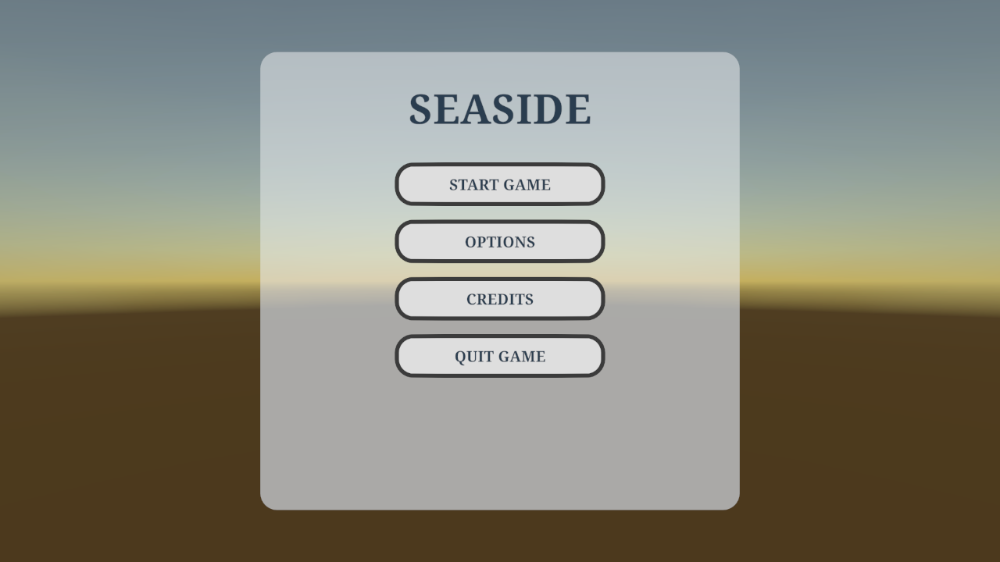
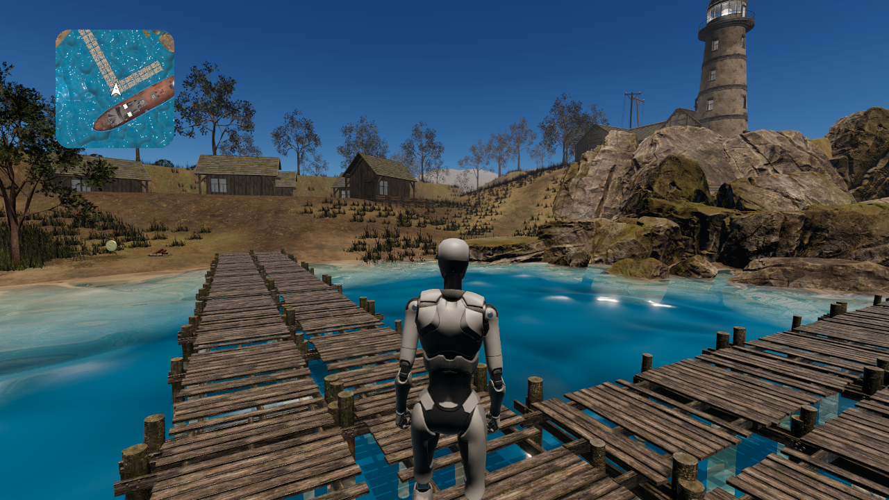

# Validation — 15 September 2026

## Changes tested

- GameManager explicitly initializes its first scene and initial game state.
- Single-scene and menu transitions use asynchronous operations with an in-flight guard.
- Additive loading validates/deduplicates requests and activates each scene before starting the next.
- LV_MainMenu's level button has one callback, SelectThisLevel.

## Results

Unity 6000.6.0f1, Seaside Editor, Windows:

- Script recompilation passed without errors.
- [Scene-flow harness](../../Tools/Validation/SceneFlowChecks.cs): all 14 assertions passed. [Raw results](scene-flow.txt).
- Direct LV_TestScene startup entered Playing; PauseMenuController showed its panel and Resume hid it, with corresponding game states.
- Main menu Options → Back activated/deactivated the expected panels.
- Live console inspection reported zero errors during these checks.
- `git diff --check` passed.

The harness invokes the real Button callbacks and manager methods; it is not a physical mouse/touch input test. It deliberately loads the menu and gameplay together to exercise two distinct loads, then returns to one menu scene. This creates a temporary duplicate EventSystem warning; it does not validate a production additive scene composition.

Other observed warnings: grass tree shader/billboarding incompatibility and graphics ring-buffer exhaustion. No performance or device-readiness claim follows from these Editor tests.

## Captures





The initial [menu capture](../Images/menu-baseline.png) was taken before the entrance animation advanced. Focusing Game view and enabling background simulation for the test resolved that apparent visibility issue; [level selection](../Images/menu-running.png) also rendered.

## Rerun the harness

Open LV_MainMenu, enter Play Mode and allow the Game view to run. Then:

```powershell
unity command run_script --file Tools/Validation/SceneFlowChecks.cs --entry SceneFlowChecks.Run --project-path C:/Users/ramin/Desktop/Repos/Seaside --format json
```

Wait for `Docs/Validation/scene-flow.txt` to receive a fresh timestamp and final PASS/FAIL. The command's initial success only means the coroutine started. The harness changes the persistent scene name in runtime memory for its additive check; exit Play Mode after running to restore authored configuration.

## Remaining coverage

Full boat arrival/traversal/interaction route, menu credits/quit/level-back flows, invalid scene configuration, true mobile touch input, checkpoint persistence, standalone PC build and iOS hardware. No build was produced in this pass.

The save of LV_MainMenu also contains Unity 6.6 serializer updates (line wrapping, TMP font feature serialization and Canvas reflection-probe defaults). Existing font and package edits predate this pass. Day/night changed the shared skybox exposure during testing; its original 1.2 value was restored through the Editor.
