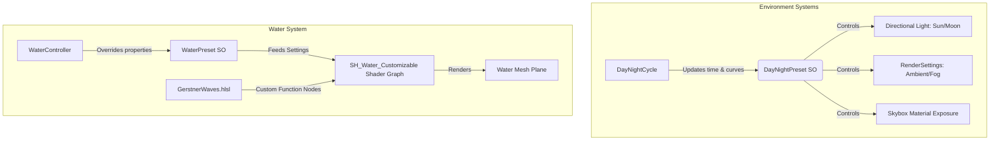

# Seaside Project Summary

Welcome to the **Seaside** project overview. This document provides a high-level summary of the game's architecture, key manager components, input configuration, and technical art systems based on indexing and crawling the workspace.

---

## 🛠️ Technology Stack & Package Dependencies

The project is built on **Unity** utilizing the **Universal Render Pipeline (URP)**. The core dependencies configured in the [manifest.json](file:///c:/Users/ramin/Desktop/Repos/Seaside/Packages/manifest.json) include:
*   **Rendering & Shading:** `com.unity.render-pipelines.universal` (17.5.0), `com.unity.shadergraph` (17.5.0), `com.unity.visualeffectgraph` (17.5.0).
*   **Input System:** `com.unity.inputsystem` (1.19.0) for handling modern multi-device and mobile touch layouts.
*   **Scene & Asset Management:** `com.unity.addressables` (2.9.1).
*   **Utilities:** `com.unity.probuilder` (6.0.9), `com.unity.cinemachine` (3.1.7), and `com.unity.ai.navigation` (2.0.13).

---

## 🏗️ Core Architecture & Decoupled State Management

The project relies on a modular, decoupled design paradigm using **ScriptableObjects** for state containment and event dispatching. This reduces hard dependencies between game components.

### 1. ScriptableObject Event Architecture
Instead of managers directly calling other components, events are broadcasted through assets:
*   [GameEventSo](file:///c:/Users/ramin/Desktop/Repos/Seaside/Assets/Scripts/Events/GameEventSo.cs): A simple ScriptableObject containing a C# `System.Action` delegate. Subscribed listeners invoke logic when `RaiseEvent()` is triggered.
*   **Specialized Events:** Includes typed ScriptableObject event channels such as [FloatEventSo](file:///c:/Users/ramin/Desktop/Repos/Seaside/Assets/Scripts/Events/FloatEventSo.cs), `IntEventSo`, and `StringEventSo`.

### 2. State & Scene Lifecycle
*   [GameStateSo](file:///c:/Users/ramin/Desktop/Repos/Seaside/Assets/Scripts/Events/GameStateSo.cs): Exposes the current general game state via the `GameState` enum: `MainMenu`, `Playing`, `Paused`, `GameOver`.
*   **Additive Loading System:** The architecture leverages a persistent gameplay coordinator setup. The main gameplay setup is housed in `Main`, while other level scenes (`LV_Level1`, `LV_Level2`, `LV_Level3`) are loaded and unloaded additively.

---

## 🎛️ Key Managers

### 1. Game Manager
The [GameManager](file:///c:/Users/ramin/Desktop/Repos/Seaside/Assets/Scripts/GameManager.cs) is a persistent Singleton (`DontDestroyOnLoad`) that serves as the central hub:
*   **Game State Transitions:** Orchestrates state machine updates and triggers appropriate events (`onGameStateChangeEvent`, `onGamePaused`, `onGameResumed`).
*   **Cursor Management:** Adjusts lock states dynamically based on the game state (locked during gameplay, free in menus/pause states).
*   **Additive Scene Loading:** Manages asynchronous level transitions, monitors progress using `_loadOperations`, and dispatches values via the `onLoadProgress` float event.
*   **Frame Rate Optimization:** Automatically disables VSync and enforces targeted FPS settings (30 vs 60 FPS mode toggles) persisted via `PlayerPrefs`.
*   **Gameplay Loops:** Spawns and tracks collectible prefabs (`CollectibleItem`) in random bounding areas, updates the counter UI, and controls win-state canvases.

### 2. Audio Manager
The [AudioManager](file:///c:/Users/ramin/Desktop/Repos/Seaside/Assets/Scripts/Core/AudioManager.cs) handles game-wide sound playback and volume customization:
*   **AudioMixer Integration:** Links to a Unity `AudioMixer` to adjust parameter groups (`MasterVolume`, `MusicVolume`, `SFXVolume`, `AmbientVolume`).
*   **Logarithmic Scaling:** Converts linear slider parameters (0.0 to 1.0) into proper logarithmic decibel levels (up to -80dB).
*   **Channel Routing:** Directs sound output into dedicated `AudioSource` channels for background music (crossfade/loop), ambient noises, and sound effects (spatialized one-shots via `PlaySFXAtPosition`).

### 3. Mobile Controls & Input Manager
Mobile deployment is supported via dynamic canvas overlay managers:
*   [MobileControlsManager](file:///c:/Users/ramin/Desktop/Repos/Seaside/Assets/Scripts/UI/MobileControlsManager.cs): Detects mobile platforms (iOS/Android) or touch simulation inside the editor, enabling/disabling the controls canvas.
*   [MobileInputHandler](file:///c:/Users/ramin/Desktop/Repos/Seaside/Assets/Scripts/UI/MobileInputHandler.cs): Gathers input from virtual UI joysticks and touch zones (sprinting, jumping, looking, and interacting) and pipes it to the player controller.
*   **Input Suppression:** When mobile mode is active, the standard mouse/keyboard input actions (e.g. `Look`, `Move`) are programmatically disabled to avoid conflicting inputs.

### 4. Player & Interaction Controllers
The player system manages movement mechanics, kinematics, and triggers:
*   [PlayerController](file:///c:/Users/ramin/Desktop/Repos/Seaside/Assets/Scripts/Player/PlayerController.cs): A state machine (`PlayerState`) managing:
    *   *Locomotion:* Idle, Walking, Running, Jumping, Falling.
    *   *Water Interactions:* Swimming logic (based on a custom water surface threshold).
    *   *Rideable Platform Kinematics:* Interacts with boat arrival paths by tracking delta position/yaw and offsetting the player kinematics through `ApplyExternalMovement()`.
*   [PlayerInteraction](file:///c:/Users/ramin/Desktop/Repos/Seaside/Assets/Scripts/Interactables/PlayerInteraction.cs): Periodically casts trigger checks for `IInteractable` targets:
    *   Finds the best target based on proximity and camera direction angle.
    *   Supports multiple interaction modalities: **Instant** (pickups), **Toggle** (doors), and **Hold** (requiring time tracking).
    *   Updates interaction UI prompts and starts/stops outline highlight shaders.

---

## 🎨 Technical Art & Environmental Systems

The visual identity of Seaside relies heavily on custom technical art systems managing global environment variables and water simulation:

### 1. Dynamic Day & Night Cycle
The environment utilizes a cycle updater:
*   [DayNightCycle](file:///c:/Users/ramin/Desktop/Repos/Seaside/Assets/Scripts/Environment/DayNightCycle.cs): Automatically rotates primary sun and moon lights around orbit tracks. It evaluates preset curves over a normalized time (0-24 hours).
*   [DayNightPreset](file:///c:/Users/ramin/Desktop/Repos/Seaside/Assets/Scripts/Environment/DayNightPreset.cs): ScriptableObject presets containing gradients and animation curves for:
    *   *Lighting:* Sun colors, sun/moon intensities.
    *   *Ambience:* Logarithmic ambient lighting color, fog color/density curves.
    *   *Atmosphere:* Real-time skybox material exposure parameters.
*   **Lifecycle Events:** Dispatches event triggers on key time thresholds (`OnSunrise`, `OnNoon`, `OnSunset`, `OnMidnight`).

### 2. Customizable Water Shader System
Water displacement and pixel rendering are fully simulated through a vertex/fragment shader pipeline:
*   [SH_Water_Customizable](file:///c:/Users/ramin/Desktop/Repos/Seaside/Assets/Shaders/Water/SH_Water_Customizable.shadergraph): A Shader Graph utilizing custom HLSL calculation passes.
*   [GerstnerWaves.hlsl](file:///c:/Users/ramin/Desktop/Repos/Seaside/Assets/Shaders/Water/GerstnerWaves.hlsl): Implements math formulas for waves, foam, depth, and caustics:
    *   *Gerstner Wave Math:* Evaluates wave wavelength, speed, time, and steepness to displace positions (xyz) and compute normal coordinates (via binormal/tangent cross products).
    *   *Layered Wave Simulation:* Combines 4 primary waves (large motion) and 2 secondary waves (surface ripples).
    *   *Depth Fading:* Samples the camera depth buffer (`_CameraDepthTexture`) to blend depth and transparency.
    *   *Edge & Crest Foam:* Masks foam textures based on water depth fade (shorelines) and wave height thresholding (crests).
    *   *Dual-Phase Caustics:* Animates double-layered caustics projections at offsetting velocities.
    *   *Refraction Offset:* Displaces UV directions using normal vectors scaled by water depth factors.
*   [WaterController](file:///c:/Users/ramin/Desktop/Repos/Seaside/Assets/Scripts/Water/WaterController.cs): Applies [WaterPreset](file:///c:/Users/ramin/Desktop/Repos/Seaside/Assets/Scripts/Water/WaterPreset.cs) settings (colors, wave values, caustics, and normal speed tiling) to the material, supporting real-time transitions (lerping presets over time).
*   [WaterPresetFactory](file:///c:/Users/ramin/Desktop/Repos/Seaside/Assets/Scripts/Water/WaterPresetFactory.cs): Provides Unity editor menu items to generate configuration presets for **Ocean**, **River** (using flow maps), **Lake**, and **Pond** environments.
